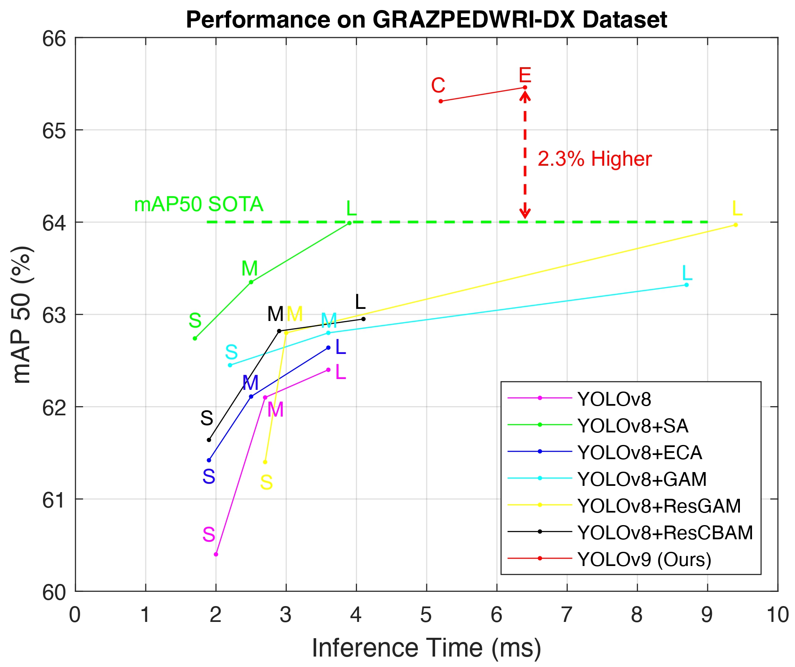
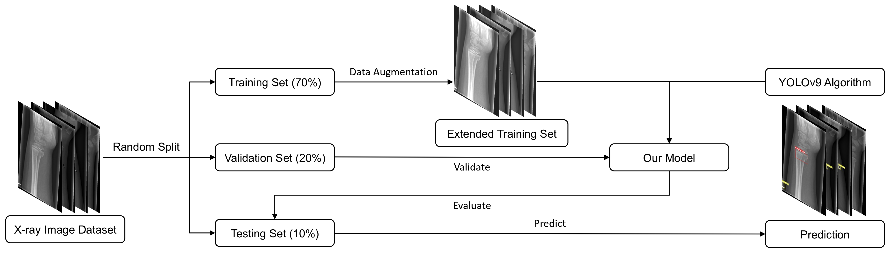
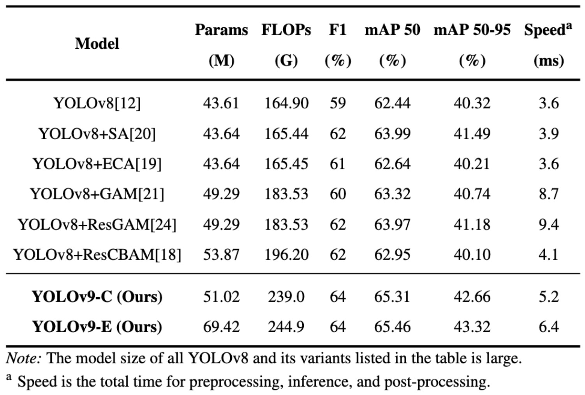
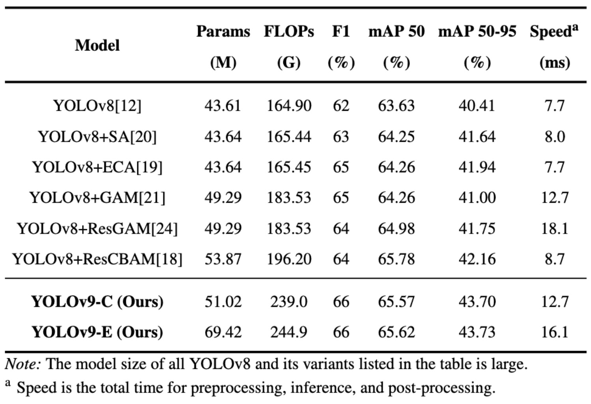

# YOLOv9 for Fracture Detection in Pediatric Wrist Trauma X-ray Images

## Abstract
The introduction of YOLOv9, the latest version of the You Only Look Once (YOLO) series, has led to its widespread adoption across various scenarios. This paper is the first to apply the YOLOv9 algorithm model to the fracture detection task, helping radiologists and surgeons in performing computer-assisted diagnosis (CAD). Specifically, this paper trained the model on the GRAZPEDWRI-DX dataset and extended the training set using data augmentation techniques to improve the model performance. The experimental results demonstrate that the mean average precision (mAP) from 50 to 95 of the YOLOv9 model increased from 42.16 to 43.73, indicating a 3.7% enhancement over the current state-of-the-art (SOTA) model.

### Comparison
<p align="left">
  
</p>

## Citation
If you find our paper useful in your research, please consider citing:


    
## Requirements
* Linux (Ubuntu)
* Python = 3.9
* Pytorch = 1.13.1
* NVIDIA GPU + CUDA CuDNN

## Environment
```
  pip install -r requirements.txt
```

## Dataset
### Overall Flowchart
<p align="left">
  
</p>

### Dataset Split
* GRAZPEDWRI-DX Dataset [(Download Link)](https://figshare.com/articles/dataset/GRAZPEDWRI-DX/14825193)
* Download dataset and put images and annotatation into `./GRAZPEDWRI-DX_dataset/data/images`, `./GRAZPEDWRI-DX_dataset/data/labels`.
  ```
    python split.py
  ```
* The dataset is divided into training, validation, and testing set (70-20-10 %) according to the key `patient_id` stored in `dataset.csv`.
* The script then will move the files into the relative folder as it is represented here below.


       GRAZPEDWRI-DX_dataset
          └── data   
               ├── images
               │    ├── train
               │    │    ├── train_img1.png
               │    │    └── ...
               │    ├── valid
               │    │    ├── valid_img1.png
               │    │    └── ...
               │    └── test
               │         ├── test_img1.png
               │         └── ...
               └── labels
                    ├── train
                    │    ├── train_annotation1.txt
                    │    └── ...
                    ├── valid
                    │    ├── valid_annotation1.txt
                    │    └── ...
                    └── test
                         ├── test_annotation1.txt
                         └── ...


The script will create 3 files: `train_data.csv`, `valid_data.csv`, and `test_data.csv` with the same structure of `dataset.csv`.

### Data Augmentation
* Data augmentation of the training set using the addWeighted function doubles the size of the training set.
```
  python imgaug.py --input_img /path/to/input/train/ --output_img /path/to/output/train/ --input_label /path/to/input/labels/ --output_label /path/to/output/labels/
```
For example:
```
  python imgaug.py --input_img ./GRAZPEDWRI-DX/data/images/train/ --output_img ./GRAZPEDWRI-DX/data/images/train_aug/ --input_label ./GRAZPEDWRI-DX/data/labels/train/ --output_label ./GRAZPEDWRI-DX/data/labels/train_aug/
```

* The path of the processed file is shown below:

       GRAZPEDWRI-DX_dataset
          └── data   
               ├── images
               │    ├── train
               │    │    ├── train_img1.png
               │    │    └── ...
               │    ├── train_aug
               │    │    ├── train_aug_img1.png
               │    │    └── ...
               │    ├── valid
               │    │    ├── valid_img1.png
               │    │    └── ...
               │    └── test
               │         ├── test_img1.png
               │         └── ...
               └── labels
                    ├── train
                    │    ├── train_annotation1.txt
                    │    └── ...
                    ├── train_aug
                    │    ├── train_aug_annotation1.txt
                    │    └── ...
                    ├── valid
                    │    ├── valid_annotation1.txt
                    │    └── ...
                    └── test
                         ├── test_annotation1.txt
                         └── ...
                         
## Model
### Weights
Iif you plan to use pretrained models, you need put them into `./weights/`.

You can get the YOLOv9 pretained models on the MS COCO 2017 Dataset through [YOLOv9 official GitHub](https://github.com/WongKinYiu/yolov9).

### Train
Before training the model, make sure the path to the data in the `./data/meta.yaml` file is correct.

* meta.yaml
```
  # patch: /path/to/GRAZPEDWRI-DX/data
  path: 'E:/GRAZPEDWRI-DX/data'
  train: 'images/train_aug'
  val: 'images/valid'
  test: 'images/test'
```

* Arguments

| Key | Value | Description |
| :---: | :---: | :---: |
| workers | 8 | number of worker threads for data loading (per RANK if DDP) |
| device | None | device to run on, i.e. device=0,1,2,3 or device=cpu |
| model | None | path to model file, i.e. yolov8n.pt, yolov8n.yaml |
| batch | 16 | number of images per batch (-1 for AutoBatch) |
| data | None | path to data file, i.e. coco128.yaml |
| img | 640 | size of input images as integer, i.e. 640, 1024 |
| cfg | yolo.yaml | path to model.yaml, i.e. yolov9-c.yaml |
| weights | None | initial weights path |
| name | exp | save to project/name |
| hyp | data/hyps/hyp.scratch-high.yaml | hyperparameters path |
| epochs | 100 | number of epochs to train for |

* Example
```
  python train_dual.py --workers 8 --device 0 --batch 16 --data data/meta.yaml --img 640 --cfg models/detect/yolov9-c.yaml --weights weights/yolov9-c.pt --name yolov9-c --hyp hyp.scratch-high.yaml --min-items 0 --epochs 100 --close-mosaic 15
```

## Experimental Results
### The input image size is 640:
<p align="left">
  
</p>

### The input image size is 1024:
<p align="left">
  
</p>
